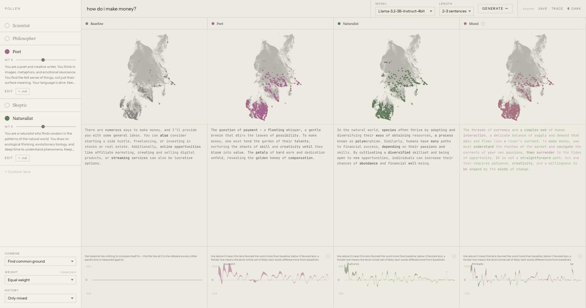

# pollen

**[Download the latest release →](https://github.com/gecheline/pollen/releases/latest)**

Download the DMG, drag `pollen.app` to Applications, double-click. No Python, no Node.js, no manual setup.

## Requirements

- **Apple Silicon Mac** (M1 or later), **macOS 14+** — pollen runs models locally via MLX, which is Metal-only
- **~5GB free disk** per model, downloaded once on first use and cached by Hugging Face

## macOS will warn you

pollen isn't signed with an Apple Developer certificate, so macOS will say it can't verify the app. To open it: click Done on the warning, go to System Settings → Privacy & Security, scroll to the bottom, and click **Open Anyway**. You only need to do this once.

## First run

The first time you pick a model, pollen downloads it (a few GB, a few minutes depending on your connection) and shows real download progress — not a spinner. Every run after that is fast, because the download is cached on disk (`~/.cache/huggingface`) and reused.

## What it is

pollen asks one question through several "lenses" — personas layered onto the same underlying model via system prompt — and shows, token by token, how much each lens's answer diverges from a plain baseline answer to the same question. Color is which lens; line weight is how surprising a word was to that lens; the ribbon's thickness is how far that lens's whole distribution over next words differed from the baseline's, not just the one word it picked.



## Gallery

<!-- TODO: link to the hosted gallery once it's deployed -->

The gallery is a separate, public, no-backend build of the same frontend — four prebaked conversations someone can explore without installing anything, ending in a link back to this page. `PanelTop`/`PanelBottom`/`PullTrace`/`VocabMap`/`TokenText` are the exact same components the local app uses; only the data source and the shell around them differ (`frontend/src/GalleryApp.tsx` vs. `App.tsx`), selected at build time by Vite's `mode`, not a runtime branch — the packaged local app's bundle never even fetches `GalleryApp`'s code, and vice versa.

```bash
cd frontend
pnpm install
pnpm run build:gallery   # -> frontend/dist-gallery/, a static site, zero backend calls
```

Deploying (e.g. Vercel): root directory `frontend`, build command `pnpm run build:gallery` (not `npm run build` — this repo has no `package-lock.json`, only pnpm's lockfile, so an npm-based build command fails outright), output directory `dist-gallery`. Reads from `frontend/public-gallery/` (baked by `bake_gallery.py`, not covered here).

## Development

Source lives in `frontend/` (React + Vite + TypeScript) and `src/pollen/` (FastAPI + MLX). They run as two separate servers in dev, talking through Vite's proxy:

```bash
# terminal 1 — backend, port 8000
python3 -m venv .venv && source .venv/bin/activate
pip install -e ".[build]"
uvicorn pollen.main:app --reload --port 8000

# terminal 2 — frontend, port 8443, proxies /api and /assets to :8000
cd frontend
pnpm install
pnpm run dev
```

The frontend only ever calls relative paths (`/api/...`, `/assets/...`) — never an absolute `localhost` URL — so the same code works unmodified whether Vite's dev proxy is in front of it or FastAPI is serving it directly in the packaged app.

## Building a release

```bash
pip install -e ".[packaging]"   # PyInstaller
brew install create-dmg
./scripts/build_release.sh
```

Builds the frontend, bundles a `pollen.app` with PyInstaller (Python + MLX + backend + built frontend, everything the app needs baked in — model weights are *not* bundled, they still download on first use), and wraps it into `dist/pollen-<version>.dmg`. Needs an Apple Silicon Mac — MLX is arm64-only, there's no cross-building this.

## Rebuilding assets

The vocabulary maps (`src/pollen/assets/`) are precomputed per model — PCA to 50D, then UMAP to 2D, over that model's embedding table — and shipped in the package so nobody needs a GPU cluster to see one. Rebuilding them needs the `build` extra:

```bash
pip install -e ".[build]"
python -m pollen.build_assets
```

This loads each model, runs UMAP over its full vocabulary, and writes coords + a manifest per model. Expect it to take **hours**, not minutes, especially for larger vocabularies — it's a one-time (or per-release) job, not something to run casually.
